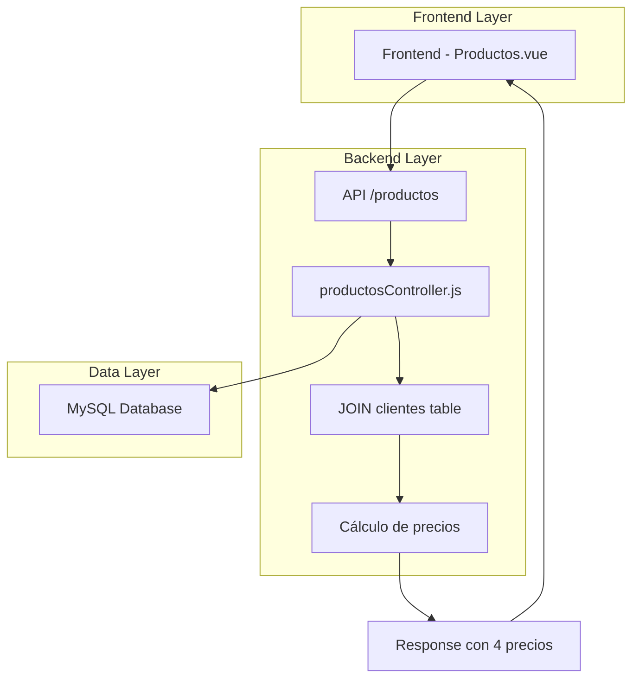
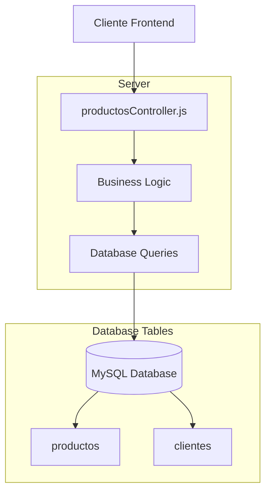
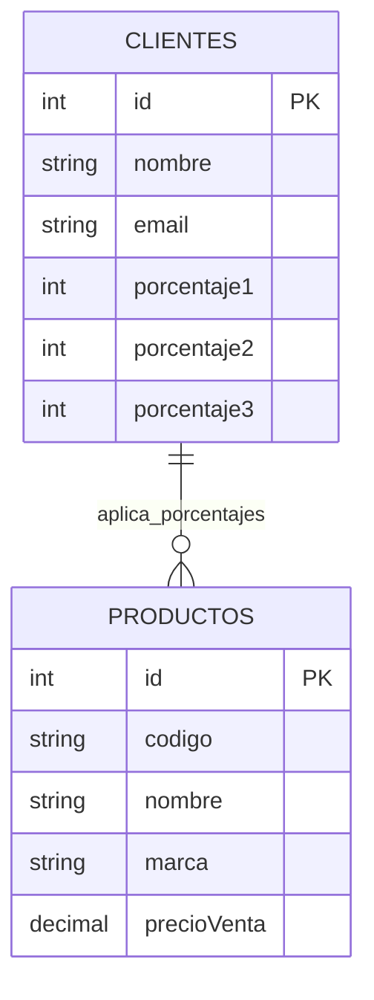

# Arquitectura Técnica - Lista de Precios con Porcentajes

## 1. Architecture design



## 2. Technology Description

* Frontend: Vue\@3 + Quasar Framework + Axios

* Backend: Node.js + Express.js

* Database: MySQL (tabla clientes con porcentaje1, porcentaje2, porcentaje3)

## 3. Route definitions

| Route          | Purpose                                                         |
| -------------- | --------------------------------------------------------------- |
| /productos     | Vista principal de lista de productos con 4 columnas de precios |
| /api/productos | Endpoint backend que retorna productos con precios calculados   |

## 4. API definitions

### 4.1 Core API

**Obtener productos con precios calculados**

```
GET /api/productos
```

Headers:

| Header Name   | Type   | Required | Description                       |
| ------------- | ------ | -------- | --------------------------------- |
| Authorization | string | true     | Token JWT del cliente autenticado |

Response:

| Param Name  | Param Type | Description                     |
| ----------- | ---------- | ------------------------------- |
| id          | number     | ID del producto                 |
| codigo      | string     | Código del producto             |
| nombre      | string     | Nombre del producto             |
| marca       | string     | Marca del producto              |
| precioBase  | number     | Precio base del producto        |
| precio1     | number     | Precio con porcentaje1 aplicado |
| precio2     | number     | Precio con porcentaje2 aplicado |
| precio3     | number     | Precio con porcentaje3 aplicado |
| porcentaje1 | number     | Porcentaje 1 del cliente        |
| porcentaje2 | number     | Porcentaje 2 del cliente        |
| porcentaje3 | number     | Porcentaje 3 del cliente        |

Example Response:

```json
[
  {
    "id": 1,
    "codigo": "PROD001",
    "nombre": "Producto Ejemplo",
    "marca": "Marca A",
    "precioBase": 100.00,
    "precio1": 110.00,
    "precio2": 115.00,
    "precio3": 120.00,
    "porcentaje1": 10,
    "porcentaje2": 15,
    "porcentaje3": 20
  }
]
```

## 5. Server architecture diagram



## 6. Data model

### 6.1 Data model definition



### 6.2 Data Definition Language

**Tabla clientes (ya existente con modificaciones)**

```sql
-- Las columnas porcentaje1, porcentaje2, porcentaje3 ya existen según el usuario
-- Verificar estructura actual:
DESCRIBE clientes;

-- Ejemplo de consulta para obtener productos con precios calculados:
SELECT 
    p.id,
    p.codigo,
    p.nombre,
    p.marca,
    p.precioVenta as precioBase,
    ROUND(p.precioVenta * (1 + COALESCE(c.porcentaje1, 0) / 100), 2) as precio1,
    ROUND(p.precioVenta * (1 + COALESCE(c.porcentaje2, 0) / 100), 2) as precio2,
    ROUND(p.precioVenta * (1 + COALESCE(c.porcentaje3, 0) / 100), 2) as precio3,
    c.porcentaje1,
    c.porcentaje2,
    c.porcentaje3
FROM productos p
LEFT JOIN clientes c ON c.id = ? -- ID del cliente autenticado
WHERE p.activo = 1
ORDER BY p.nombre;
```

**Modificaciones requeridas en productosController.js:**

```javascript
// Agregar JOIN con tabla clientes
// Calcular precios dinámicamente
// Incluir porcentajes en la respuesta
// Manejar casos donde cliente no tiene porcentajes definidos
```

**Modificaciones requeridas en Productos.vue:**

```javascript
// Actualizar headers de la tabla para incluir 4 columnas de precios
// Modificar el template para mostrar los precios calculados
// Mantener funcionalidad de filtros existente
```

