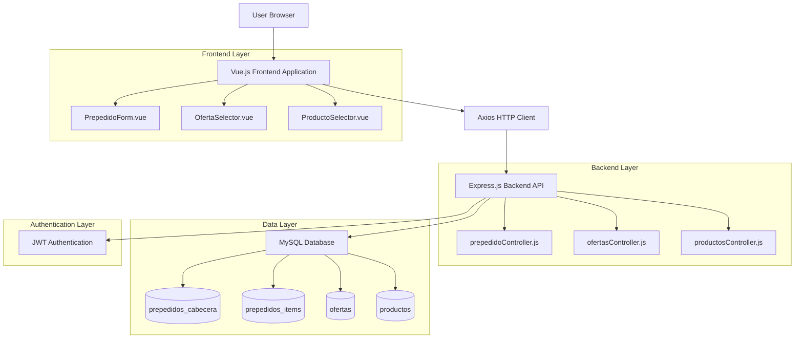
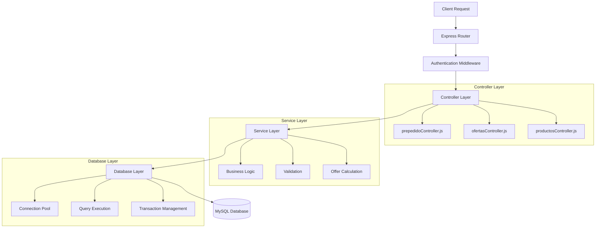
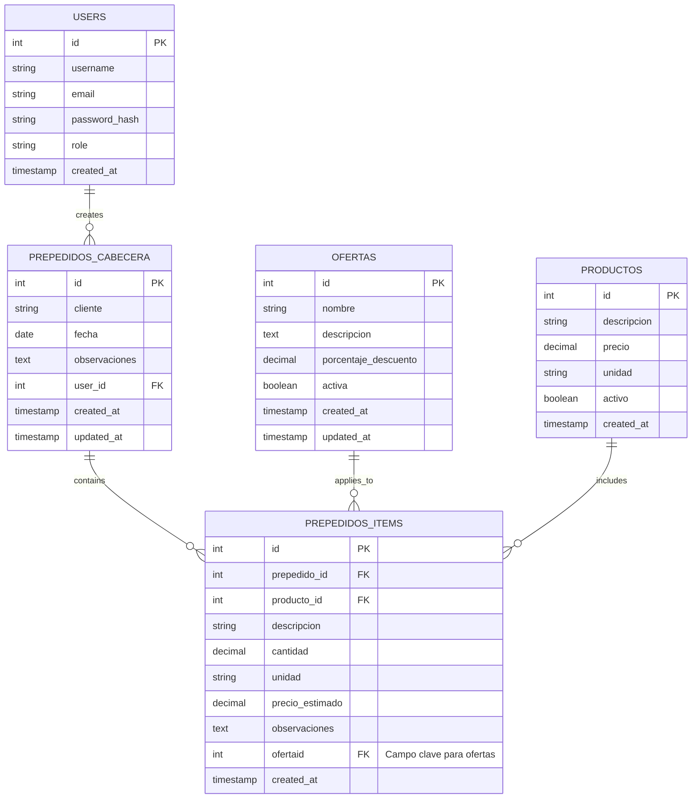

## 1. Architecture design



## 2. Technology Description

- Frontend: Vue.js@3 + Vuetify@3 + Vue Router@4 + Axios + Vite
- Backend: Node.js@18 + Express.js@4 + MySQL2 + JWT + bcrypt
- Database: MySQL@8.0

## 3. Route definitions

| Route | Purpose |
|-------|---------|
| /prepedidos | Lista principal de pre-pedidos con filtros y búsqueda |
| /prepedidos/nuevo | Formulario de creación de nuevo pre-pedido |
| /prepedidos/:id/editar | Formulario de edición de pre-pedido existente |
| /ofertas | Gestión administrativa de ofertas disponibles |
| /ofertas/nueva | Formulario de creación de nueva oferta |
| /dashboard | Panel de métricas y reportes de ofertas |
| /productos | Catálogo de productos disponibles |
| /login | Página de autenticación de usuarios |

## 4. API definitions

### 4.1 Core API

**Pre-pedidos con ofertas**

```
GET /api/prepedidos
```
Response:
| Param Name | Param Type | Description |
|------------|------------|-------------|
| id | number | ID único del pre-pedido |
| cliente | string | Nombre del cliente |
| fecha | string | Fecha de creación |
| items | array | Array de items con ofertas aplicadas |
| total | number | Total calculado con descuentos |

```
POST /api/prepedidos
```
Request:
| Param Name | Param Type | isRequired | Description |
|------------|------------|------------|-------------|
| cliente | string | true | Nombre del cliente |
| observaciones | string | false | Observaciones adicionales |
| items | array | true | Array de items con ofertaid opcional |

```
PUT /api/prepedidos/:id
```
Request:
| Param Name | Param Type | isRequired | Description |
|------------|------------|------------|-------------|
| items | array | true | Items actualizados con ofertaid |
| observaciones | string | false | Observaciones modificadas |

**Gestión de ofertas**

```
GET /api/ofertas
```
Response:
| Param Name | Param Type | Description |
|------------|------------|-------------|
| id | number | ID único de la oferta |
| nombre | string | Nombre descriptivo de la oferta |
| descripcion | string | Descripción detallada |
| porcentaje_descuento | number | Porcentaje de descuento (0-100) |
| activa | boolean | Estado de la oferta |

```
POST /api/ofertas
```
Request:
| Param Name | Param Type | isRequired | Description |
|------------|------------|------------|-------------|
| nombre | string | true | Nombre de la oferta |
| descripcion | string | false | Descripción de la oferta |
| porcentaje_descuento | number | true | Porcentaje de descuento |
| activa | boolean | true | Estado inicial de la oferta |

**Productos con ofertas**

```
GET /api/productos/search
```
Request:
| Param Name | Param Type | isRequired | Description |
|------------|------------|------------|-------------|
| q | string | true | Término de búsqueda |
| limit | number | false | Límite de resultados (default: 10) |

Response:
| Param Name | Param Type | Description |
|------------|------------|-------------|
| id | number | ID del producto |
| descripcion | string | Descripción del producto |
| precio | number | Precio base del producto |
| unidad | string | Unidad de medida |

Example Request:
```json
{
  "cliente": "Cliente Ejemplo",
  "observaciones": "Pre-pedido con ofertas especiales",
  "items": [
    {
      "productoId": 367,
      "descripcion": "GL 75W 90 SINTETICO AUTOBLOCANTE BALDE 20 L - AMA",
      "cantidad": 3,
      "unidad": "20.000",
      "precioEstimado": "141950.00",
      "observaciones": "",
      "ofertaid": 61
    }
  ]
}
```

## 5. Server architecture diagram



## 6. Data model

### 6.1 Data model definition



### 6.2 Data Definition Language

**Tabla de ofertas (ofertas)**
```sql
-- Crear tabla de ofertas
CREATE TABLE ofertas (
    id INT AUTO_INCREMENT PRIMARY KEY,
    nombre VARCHAR(255) NOT NULL,
    descripcion TEXT,
    porcentaje_descuento DECIMAL(5,2) NOT NULL CHECK (porcentaje_descuento >= 0 AND porcentaje_descuento <= 100),
    activa BOOLEAN DEFAULT TRUE,
    created_at TIMESTAMP DEFAULT CURRENT_TIMESTAMP,
    updated_at TIMESTAMP DEFAULT CURRENT_TIMESTAMP ON UPDATE CURRENT_TIMESTAMP
);

-- Índices para optimización
CREATE INDEX idx_ofertas_activa ON ofertas(activa);
CREATE INDEX idx_ofertas_porcentaje ON ofertas(porcentaje_descuento);

-- Datos iniciales de ofertas
INSERT INTO ofertas (nombre, descripcion, porcentaje_descuento, activa) VALUES
('Descuento 10%', 'Descuento general del 10%', 10.00, TRUE),
('Descuento 15%', 'Descuento especial del 15%', 15.00, TRUE),
('Descuento 20%', 'Descuento promocional del 20%', 20.00, TRUE),
('Descuento 25%', 'Descuento mayorista del 25%', 25.00, TRUE);
```

**Actualización de prepedidos_items para ofertas**
```sql
-- Agregar campo ofertaid a prepedidos_items
ALTER TABLE prepedidos_items 
ADD COLUMN ofertaid INT NULL,
ADD CONSTRAINT fk_prepedidos_items_oferta 
    FOREIGN KEY (ofertaid) REFERENCES ofertas(id) ON DELETE SET NULL;

-- Índice para optimización de consultas con ofertas
CREATE INDEX idx_prepedidos_items_ofertaid ON prepedidos_items(ofertaid);

-- Índice compuesto para consultas frecuentes
CREATE INDEX idx_prepedidos_items_prepedido_oferta ON prepedidos_items(prepedido_id, ofertaid);
```

**Tabla de productos (productos)**
```sql
-- Crear tabla de productos si no existe
CREATE TABLE IF NOT EXISTS productos (
    id INT AUTO_INCREMENT PRIMARY KEY,
    descripcion VARCHAR(500) NOT NULL,
    precio DECIMAL(10,2) NOT NULL DEFAULT 0.00,
    unidad VARCHAR(50) DEFAULT 'UNIDAD',
    activo BOOLEAN DEFAULT TRUE,
    created_at TIMESTAMP DEFAULT CURRENT_TIMESTAMP,
    updated_at TIMESTAMP DEFAULT CURRENT_TIMESTAMP ON UPDATE CURRENT_TIMESTAMP
);

-- Índices para búsqueda optimizada
CREATE INDEX idx_productos_descripcion ON productos(descripcion);
CREATE INDEX idx_productos_activo ON productos(activo);
CREATE FULLTEXT INDEX idx_productos_search ON productos(descripcion);
```

**Permisos de base de datos para Supabase**
```sql
-- Permisos básicos para rol anon (lectura de ofertas y productos)
GRANT SELECT ON ofertas TO anon;
GRANT SELECT ON productos TO anon;

-- Permisos completos para rol authenticated
GRANT ALL PRIVILEGES ON prepedidos_cabecera TO authenticated;
GRANT ALL PRIVILEGES ON prepedidos_items TO authenticated;
GRANT ALL PRIVILEGES ON ofertas TO authenticated;
GRANT ALL PRIVILEGES ON productos TO authenticated;

-- Políticas de seguridad a nivel de fila (RLS)
ALTER TABLE prepedidos_cabecera ENABLE ROW LEVEL SECURITY;
ALTER TABLE prepedidos_items ENABLE ROW LEVEL SECURITY;

-- Política para que usuarios solo vean sus propios pre-pedidos
CREATE POLICY "Users can view own prepedidos" ON prepedidos_cabecera
    FOR SELECT USING (user_id = auth.uid());

CREATE POLICY "Users can insert own prepedidos" ON prepedidos_cabecera
    FOR INSERT WITH CHECK (user_id = auth.uid());
```