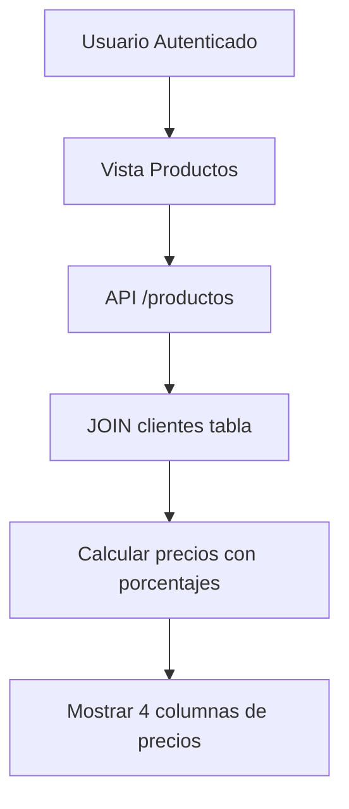

# PRD - Lista de Precios con Porcentajes por Cliente

## 1. Product Overview
Sistema de lista de precios que muestra múltiples niveles de precios basados en porcentajes específicos por cliente. La funcionalidad permite visualizar el precio base junto con tres variaciones calculadas usando los porcentajes almacenados en la tabla clientes.

## 2. Core Features

### 2.1 User Roles
| Role | Registration Method | Core Permissions |
|------|---------------------|------------------|
| Cliente Autenticado | Login con credenciales | Puede ver lista de precios con sus porcentajes específicos |
| Administrador | Acceso directo al sistema | Puede gestionar productos y ver todas las listas de precios |

### 2.2 Feature Module
Nuestra funcionalidad de lista de precios consiste en las siguientes modificaciones principales:
1. **Vista Productos**: Mostrar 4 columnas de precios (Base, +%1, +%2, +%3)
2. **Backend API**: Calcular precios dinámicamente basados en porcentajes del cliente
3. **Autenticación**: Identificar cliente para aplicar porcentajes correctos

### 2.3 Page Details
| Page Name | Module Name | Feature description |
|-----------|-------------|---------------------|
| Lista Productos | Tabla de precios | Mostrar precio base y tres precios calculados con porcentajes. Aplicar cálculo: precio_base * (1 + porcentaje/100) |
| API Productos | Controlador backend | Realizar JOIN con tabla clientes, obtener porcentajes específicos, calcular precios dinámicamente |
| Autenticación | Sistema de login | Identificar cliente autenticado para aplicar porcentajes correctos |

## 3. Core Process
**Flujo Principal del Usuario:**
1. Usuario se autentica en el sistema
2. Navega a la vista de Productos
3. Sistema identifica al cliente y obtiene sus porcentajes (porcentaje1, porcentaje2, porcentaje3)
4. Backend calcula los precios: Base, Base+%1, Base+%2, Base+%3
5. Frontend muestra tabla con 4 columnas de precios
6. Usuario puede visualizar todos los niveles de precios disponibles

## 4. User Interface Design
### 4.1 Design Style
- **Colores primarios**: Mantener esquema actual del sistema
- **Estilo de tabla**: DataTable con 4 columnas de precios claramente diferenciadas
- **Tipografía**: Fuente monoespaciada para precios para mejor alineación
- **Layout**: Tabla responsiva con scroll horizontal si es necesario
- **Iconos**: Símbolos de moneda ($) para identificar columnas de precios

### 4.2 Page Design Overview
| Page Name | Module Name | UI Elements |
|-----------|-------------|-------------|
| Lista Productos | Tabla principal | 4 columnas de precios: "Precio Base", "Precio +%1", "Precio +%2", "Precio +%3". Formato moneda con 2 decimales. Headers con colores diferenciados |
| Lista Productos | Filtros | Mantener filtros existentes (búsqueda, marca, categoría) |

### 4.3 Responsiveness
- **Desktop-first**: Optimizado para pantallas grandes donde se pueden ver las 4 columnas
- **Mobile-adaptive**: En móviles, permitir scroll horizontal o colapsar columnas menos importantes
- **Touch-friendly**: Botones y controles adaptados para dispositivos táctiles