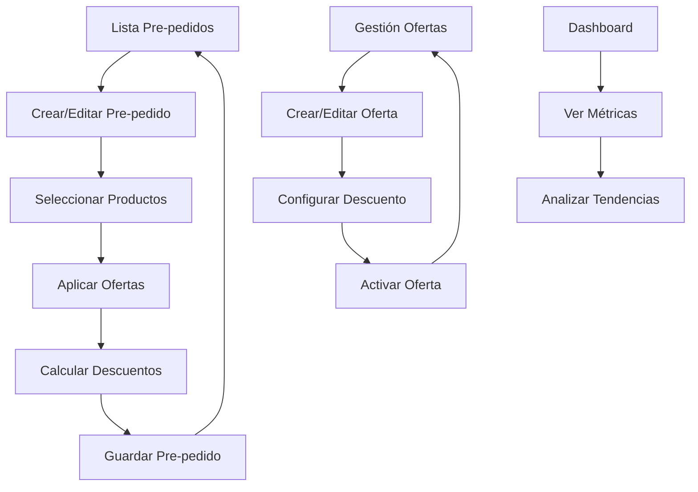

## 1. Product Overview

Sistema completo de gestión de ofertas integrado en pre-pedidos para Nalub, permitiendo aplicar descuentos automáticos y personalizados a productos específicos durante la creación y edición de pre-pedidos.

- El sistema resuelve la necesidad de aplicar ofertas dinámicas a productos individuales dentro de pre-pedidos, automatizando el cálculo de descuentos y mejorando la experiencia del usuario.
- Dirigido a vendedores y administradores de Nalub que gestionan pre-pedidos con descuentos especiales.
- Incrementa la eficiencia en la gestión comercial y mejora la precisión en la aplicación de ofertas.

## 2. Core Features

### 2.1 User Roles

| Role | Registration Method | Core Permissions |
|------|---------------------|------------------|
| Vendedor | Login con credenciales existentes | Crear y editar pre-pedidos, aplicar ofertas disponibles |
| Administrador | Acceso completo del sistema | Gestión completa de ofertas, pre-pedidos y configuración del sistema |

### 2.2 Feature Module

Nuestro sistema de ofertas en pre-pedidos consiste de las siguientes páginas principales:

1. **Lista de Pre-pedidos**: visualización de pre-pedidos existentes, indicadores de ofertas aplicadas, acciones de edición.
2. **Formulario de Pre-pedidos**: creación/edición de pre-pedidos, selector de productos, aplicación de ofertas por item.
3. **Gestión de Ofertas**: administración de ofertas disponibles, configuración de descuentos, activación/desactivación.
4. **Dashboard**: métricas de ofertas aplicadas, reportes de descuentos, análisis de efectividad.

### 2.3 Page Details

| Page Name | Module Name | Feature description |
|-----------|-------------|---------------------|
| Lista de Pre-pedidos | Lista Principal | Mostrar pre-pedidos con indicadores visuales de ofertas aplicadas, filtros por estado y fecha |
| Lista de Pre-pedidos | Acciones Rápidas | Editar, duplicar, eliminar pre-pedidos con confirmaciones de seguridad |
| Formulario de Pre-pedidos | Información General | Capturar datos básicos del pre-pedido: cliente, fecha, observaciones |
| Formulario de Pre-pedidos | Selector de Productos | Búsqueda y selección de productos con autocompletado y vista previa |
| Formulario de Pre-pedidos | Aplicador de Ofertas | Selector visual de ofertas disponibles por producto con cálculo automático de descuentos |
| Formulario de Pre-pedidos | Resumen de Items | Lista de productos agregados con ofertas aplicadas, totales calculados automáticamente |
| Gestión de Ofertas | Lista de Ofertas | Visualizar ofertas activas/inactivas con porcentajes de descuento y fechas de vigencia |
| Gestión de Ofertas | Formulario de Ofertas | Crear/editar ofertas con nombre, descripción, porcentaje de descuento y estado |
| Dashboard | Métricas de Ofertas | Mostrar estadísticas de ofertas más utilizadas, descuentos aplicados, tendencias |

## 3. Core Process

### Flujo Principal del Usuario (Vendedor)

El vendedor accede al sistema, navega a la lista de pre-pedidos donde puede crear uno nuevo o editar uno existente. Durante la creación/edición, selecciona productos y para cada uno puede aplicar ofertas disponibles. El sistema calcula automáticamente los descuentos y muestra el total actualizado. Finalmente guarda el pre-pedido con las ofertas aplicadas.

### Flujo Administrativo

El administrador gestiona el catálogo de ofertas, creando nuevas ofertas con porcentajes de descuento específicos, activando/desactivando ofertas según necesidades comerciales, y monitoreando el uso de ofertas a través del dashboard con métricas detalladas.

## 4. User Interface Design

### 4.1 Design Style

- **Colores primarios**: Azul corporativo (#1976D2), Verde para ofertas (#4CAF50)
- **Colores secundarios**: Gris claro (#F5F5F5), Naranja para alertas (#FF9800)
- **Estilo de botones**: Redondeados con elevación sutil, efectos hover suaves
- **Tipografía**: Roboto 14px para texto general, 16px para títulos, 12px para detalles
- **Layout**: Diseño de tarjetas con espaciado generoso, navegación superior fija
- **Iconos**: Material Design Icons, con énfasis en iconos de descuento y ofertas

### 4.2 Page Design Overview

| Page Name | Module Name | UI Elements |
|-----------|-------------|-------------|
| Lista de Pre-pedidos | Lista Principal | Tabla responsiva con chips coloridos para ofertas, botones de acción flotantes, filtros desplegables |
| Formulario de Pre-pedidos | Selector de Productos | Autocompletado con vista previa de producto, botón "Agregar" prominente, campos de cantidad y unidad |
| Formulario de Pre-pedidos | Aplicador de Ofertas | Dropdown elegante con vista previa de descuento, chip visual de oferta seleccionada, cálculo en tiempo real |
| Formulario de Pre-pedidos | Resumen de Items | Lista con separadores visuales, totales destacados, iconos de ofertas aplicadas |
| Gestión de Ofertas | Lista de Ofertas | Cards con estado visual (activo/inactivo), porcentajes destacados, acciones rápidas |
| Dashboard | Métricas de Ofertas | Gráficos coloridos, KPIs en cards destacadas, tablas de ranking de ofertas |

### 4.3 Responsiveness

El sistema es mobile-first con adaptación completa para tablets y desktop. Incluye optimización táctil para selección de ofertas en dispositivos móviles, con gestos intuitivos y botones de tamaño adecuado para interacción táctil.