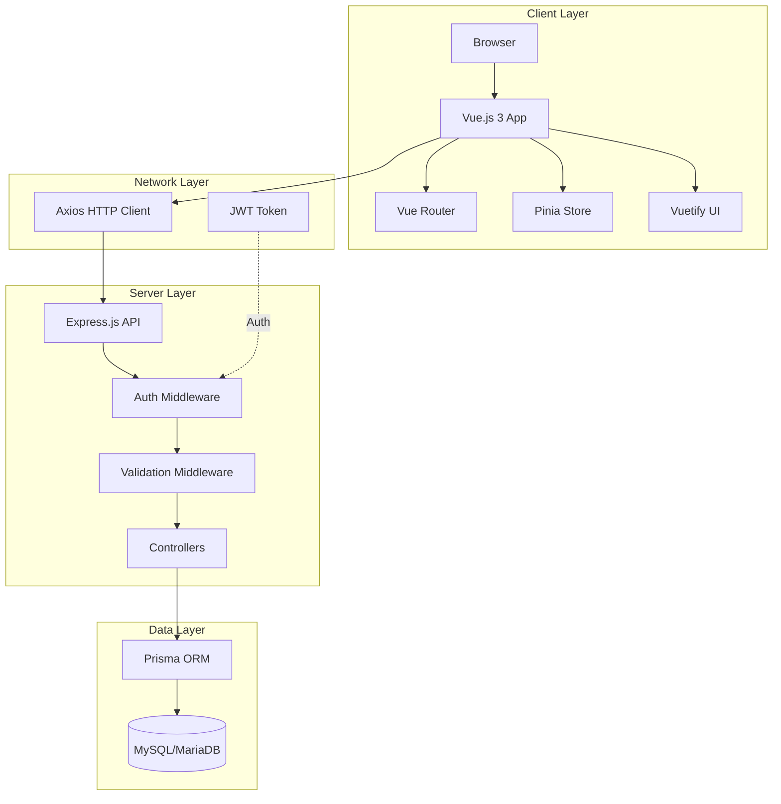
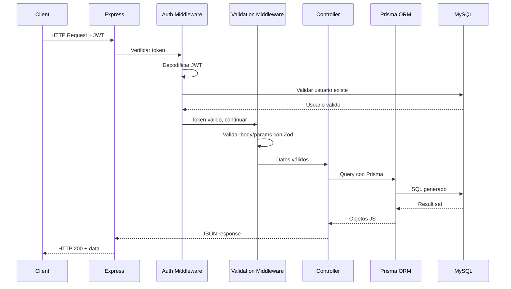
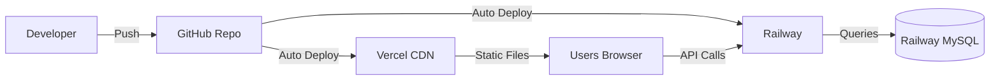
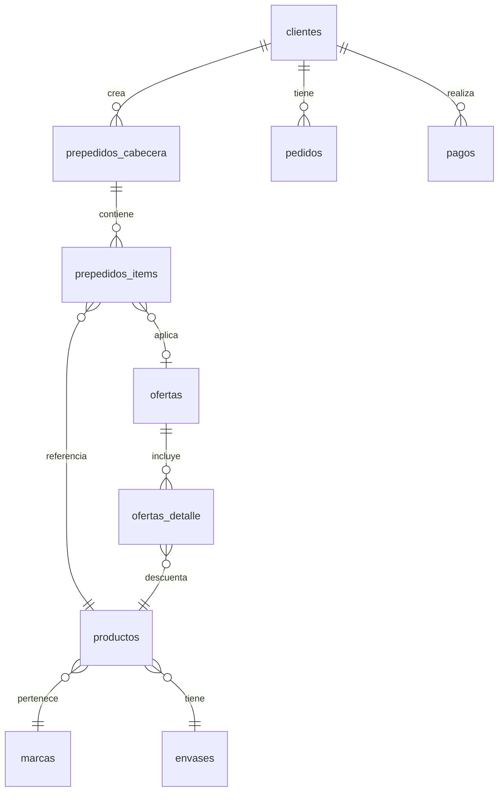

# 🏗️ Arquitectura Técnica - Sistema Nalub Pedidos

## 1. Visión General

Sistema web full-stack con arquitectura **cliente-servidor separada**, comunicándose mediante API REST sobre HTTP/HTTPS.



---

## 2. Arquitectura Frontend

### 2.1 Estructura de Componentes

**Patrón:** Componentes Vue 3 con Composition API + SFC (Single File Components)

```
frontend/src/
├── App.vue                     # Componente raíz
├── main.js                     # Punto de entrada
├── components/                 # Componentes reutilizables
│   ├── OfertaSelector.vue     # Selector de ofertas
│   ├── ProductSelector.vue    # Selector de productos
│   └── ...
├── views/                      # Vistas/Páginas
│   ├── auth/
│   │   ├── Login.vue          # Página de login
│   │   └── Perfil.vue         # Perfil de usuario
│   ├── dashboard/
│   │   └── Dashboard.vue      # Dashboard principal
│   ├── ofertas/
│   │   └── Ofertas.vue        # Gestión de ofertas
│   ├── pagos/
│   │   └── PagosList.vue      # Historial de pagos
│   ├── pedidos/
│   │   ├── PedidosList.vue    # Lista de pedidos
│   │   └── PedidoDetail.vue   # Detalle de pedido
│   ├── prepedidos/
│   │   ├── Prepedidos.vue     # Lista de prepedidos
│   │   └── PrepedidoForm.vue  # Formulario de prepedido
│   └── productos/
│       └── Productos.vue      # Catálogo de productos
├── services/                   # Servicios de API
│   ├── api.js                 # Cliente Axios configurado
│   ├── ofertasService.js      # API de ofertas
│   ├── pagosService.js        # API de pagos
│   ├── pedidosService.js      # API de pedidos
│   └── productosService.js    # API de productos
├── stores/                     # State Management
│   └── auth.js                # Store de autenticación
├── router/                     # Navegación
│   └── index.js               # Configuración de rutas
└── utils/                      # Utilidades
    └── currency.js            # Formateo de moneda
```

### 2.2 Flujo de Datos

**Patrón Unidireccional:**
1. Usuario interactúa con componente Vue
2. Componente dispara una acción (service call)
3. Service hace request HTTP con Axios
4. Response actualiza estado local (reactive data)
5. UI se re-renderiza automáticamente (reactivity)

**State Management:**
- **Local state**: `ref()`, `reactive()` en cada componente
- **Global state**: Pinia stores para auth
- **Computed values**: `computed()` para valores derivados

### 2.3 Routing

**Lazy Loading de Rutas:**
```javascript
{
  path: '/dashboard',
  name: 'Dashboard',
  component: () => import('../views/dashboard/Dashboard.vue'),
  meta: { requiresAuth: true }
}
```

**Guard de Autenticación:**
```javascript
router.beforeEach((to, from, next) => {
  if (to.meta.requiresAuth && !isAuthenticated) {
    next('/login')
  } else {
    next()
  }
})
```

### 2.4 PWA (Progressive Web App)

**Service Worker:**
- Caché de assets estáticos (JS, CSS, imágenes)
- Estrategia: `NetworkFirst` para API, `CacheFirst` para assets
- Auto-actualización en segundo plano

**Manifest:**
```json
{
  "name": "Nalub Pedidos",
  "short_name": "Nalub",
  "theme_color": "#1976D2",
  "background_color": "#ffffff",
  "display": "standalone",
  "scope": "/",
  "start_url": "/"
}
```

---

## 3. Arquitectura Backend

### 3.1 Estructura de Capas

**Patrón MVC (Model-View-Controller)** adaptado para API REST:

```
backend/
├── app.js                      # Punto de entrada, configuración Express
├── config/
│   └── database.js            # Config legacy (MySQL2 directo)
├── controllers/                # CONTROLADORES (Lógica de negocio)
│   ├── authController.js      # Login, cambio de contraseña
│   ├── dashboardController.js # Dashboard data, ofertas destacadas
│   ├── ofertasController.js   # CRUD de ofertas + cálculos
│   ├── pagosController.js     # Historial de pagos
│   ├── pedidosController.js   # Lista y detalle de pedidos
│   ├── prepedidoController.js # CRUD de prepedidos
│   ├── productosController.js # Catálogo, búsqueda, marcas, envases
│   └── userController.js      # Perfil de usuario
├── routes/                     # RUTAS (Definición de endpoints)
│   ├── auth.js                # POST /api/auth/login
│   ├── dashboard.js           # GET /api/dashboard
│   ├── ofertas.js             # CRUD /api/ofertas
│   ├── pagos.js               # GET /api/pagos
│   ├── pedidos.js             # GET /api/pedidos
│   ├── prepedidos.js          # CRUD /api/prepedidos
│   ├── productos.js           # GET /api/productos
│   └── users.js               # GET/PUT /api/users
├── middleware/                 # MIDDLEWARE
│   ├── auth.js                # Verificación de JWT
│   └── validateRequest.js     # Validación Zod
├── schemas/                    # ESQUEMAS DE VALIDACIÓN
│   └── validation.js          # 7 schemas Zod
└── prisma/                     # ORM
    ├── schema.prisma          # Definición de modelos
    └── lib/
        └── prisma.js          # Cliente Prisma singleton
```

### 3.2 Flujo de Request



### 3.3 Autenticación y Autorización

**JWT (JSON Web Token):**
```javascript
// Payload del token
{
  userId: 14,
  iat: 1738858000,  // Issued at
  exp: 1738944400   // Expiration (24h)
}
```

**Middleware de Autenticación:**
1. Extrae token del header `Authorization: Bearer <token>`
2. Verifica firma con `JWT_SECRET`
3. Decodifica payload
4. Valida que el usuario existe en BD
5. Adjunta `req.user` con datos del usuario
6. Permite continuar o rechaza con 401

### 3.4 Validación de Datos

**Zod Schemas:**
```javascript
// Ejemplo: schema de login
const loginSchema = z.object({
  usuario: z.string().min(1),
  password: z.string().min(1)
});

// Middleware de validación
const validateRequest = (schema, source = 'body') => {
  return (req, res, next) => {
    const result = schema.safeParse(req[source]);
    if (!result.success) {
      return res.status(400).json({
        success: false,
        errors: result.error.errors
      });
    }
    next();
  };
};
```

**Schemas disponibles:**
1. `loginSchema` - Login
2. `changePasswordSchema` - Cambio de contraseña
3. `createPrepedidoSchema` - Crear prepedido
4. `updatePrepedidoSchema` - Actualizar prepedido
5. `productSearchSchema` - Búsqueda de productos
6. `validateIdSchema` - Validación de IDs
7. `calcularPrecioOfertaSchema` - Calcular precio con oferta

### 3.5 ORM y Base de Datos

**Prisma ORM:**
- Cliente generado desde introspección de BD existente
- 35 modelos mapeados
- Type-safe queries con autocomplete
- Manejo automático de conexiones
- Logging en desarrollo

**Ejemplo de Query Prisma:**
```javascript
// SQL tradicional
const result = await executeQuery(
  'SELECT * FROM productos WHERE stockActual > ? AND precioVenta > ?',
  [0, 0]
);

// Prisma ORM
const productos = await prisma.productos.findMany({
  where: {
    stockActual: { gt: 0 },
    precioVenta: { gt: 0 }
  },
  include: {
    marcas: true,
    envases: {
      include: {
        tipoEnvase: true
      }
    }
  }
});
```

**Ventajas:**
- Prevención de SQL injection
- Autocomplete en IDE
- Type safety
- Queries optimizadas
- Manejo automático de relaciones

---

## 4. Comunicación Cliente-Servidor

### 4.1 Protocolo HTTP/HTTPS

**Base URL:**
- Desarrollo: `http://localhost:3001/api`
- Producción: `https://api.nalub.com/api`

**Headers estándar:**
```http
Content-Type: application/json
Authorization: Bearer <jwt_token>
```

### 4.2 Formato de Respuestas

**Success Response:**
```json
{
  "success": true,
  "data": {
    "id": 1,
    "nombre": "Cliente"
  }
}
```

**Error Response:**
```json
{
  "success": false,
  "message": "Error descriptivo",
  "errors": [
    {
      "field": "email",
      "message": "Email inválido"
    }
  ]
}
```

### 4.3 Códigos HTTP

| Código | Significado | Uso |
|--------|-------------|-----|
| 200 | OK | Operación exitosa |
| 201 | Created | Recurso creado |
| 400 | Bad Request | Validación fallida |
| 401 | Unauthorized | Token inválido o expirado |
| 403 | Forbidden | Sin permisos |
| 404 | Not Found | Recurso no encontrado |
| 500 | Internal Error | Error del servidor |

---

## 5. Seguridad

### 5.1 Capas de Seguridad

**1. Network Layer:**
- HTTPS en producción (TLS 1.3)
- CORS configurado para dominios específicos

**2. Authentication Layer:**
- JWT con expiración de 24h
- Bcrypt para hash de contraseñas (salt rounds: 10)

**3. Application Layer:**
- Helmet para headers HTTP seguros
- Rate limiting (100 req/15min global, 5 req/15min login)
- Validación de entrada con Zod

**4. Data Layer:**
- Prisma ORM (queries parametrizadas)
- Principio de least privilege en BD

### 5.2 Protección contra Ataques

**SQL Injection:** ✅ Prisma ORM usa queries parametrizadas
**XSS:** ✅ Vue escapa contenido por defecto
**CSRF:** ✅ JWT en header Authorization (no cookies)
**Brute Force:** ✅ Rate limiting en login (5 intentos/15min)
**DoS:** ✅ Rate limiting global + compression

---

## 6. Performance

### 6.1 Frontend

**Optimizaciones implementadas:**
- ✅ Code splitting por ruta (lazy loading)
- ✅ Tree shaking automático (Vite)
- ✅ Minificación JS/CSS en producción
- ✅ Compresión gzip/brotli
- ✅ Caché de assets con service worker
- ✅ Preload de rutas críticas

**Métricas objetivo:**
- First Contentful Paint: < 1.5s
- Time to Interactive: < 3s
- Lighthouse Score: > 90

### 6.2 Backend

**Optimizaciones implementadas:**
- ✅ Prisma connection pooling
- ✅ Compresión de respuestas HTTP (gzip)
- ✅ Queries optimizadas con includes selectivos
- ✅ Conversión de BLOBs en JavaScript (no en BD)

**Optimizaciones pendientes:**
- [ ] Caché con Redis para queries frecuentes
- [ ] Paginación en todos los listados grandes
- [ ] Índices de BD optimizados

---

## 7. Escalabilidad

### 7.1 Horizontal Scaling

**Frontend:**
- ✅ Stateless (JWT en localStorage)
- ✅ Deployable en CDN (Vercel)
- ✅ Múltiples instancias posibles

**Backend:**
- ✅ Stateless (JWT, no sessions)
- ✅ Prisma connection pooling
- 🔄 Load balancer (Railway auto-scaling)

### 7.2 Vertical Scaling

**Límites actuales:**
- MySQL: 1GB RAM, 10 conexiones
- Node.js: 512MB RAM por instancia

**Mejoras planificadas:**
- Aumento de recursos en Railway
- Optimización de queries pesadas

---

## 8. Monitoreo y Logging

### 8.1 Logging Backend

**Niveles de log (Prisma):**
```javascript
{
  log: [
    { level: 'query', emit: 'stdout' },    // Solo en dev
    { level: 'info', emit: 'stdout' },     // En prod
    { level: 'warn', emit: 'stdout' },     // En prod
    { level: 'error', emit: 'stdout' }     // Siempre
  ]
}
```

### 8.2 Error Tracking

**Actual:**
- Console logs en desarrollo
- Railway logs en producción

**Recomendado para producción:**
- [ ] Sentry para error tracking
- [ ] Winston para structured logging
- [ ] Grafana para métricas

---

## 9. Testing

### 9.1 Estado Actual

**Frontend:**
- ❌ No hay tests automatizados
- ✅ Testing manual en navegador

**Backend:**
- ❌ No hay tests automatizados
- ✅ Testing manual con clientes API

### 9.2 Plan de Testing

**Próxima fase:**
- [ ] Jest para unit tests (backend)
- [ ] Vitest para unit tests (frontend)
- [ ] Supertest para integration tests (API)
- [ ] Playwright para E2E tests

---

## 10. DevOps

### 10.1 CI/CD

**Actual:**
- Git push → Railway auto-deploy
- Git push → Vercel auto-deploy

**Futuro:**
- [ ] GitHub Actions para tests pre-deploy
- [ ] Staging environment

### 10.2 Environments

| Env | Frontend | Backend | Database |
|-----|----------|---------|----------|
| Development | localhost:5173 | localhost:3001 | localhost:3306 |
| Production | nalub.vercel.app | nalub.railway.app | Railway MySQL |

---

## 11. Dependencias Clave

### Backend
- `express@4.18.2` - Framework web
- `@prisma/client@5.22.0` - ORM
- `jsonwebtoken@9.0.2` - JWT
- `zod@4.3.6` - Validación
- `helmet@7.2.0` - Seguridad
- `express-rate-limit@7.5.1` - Rate limiting

### Frontend
- `vue@3.5.18` - Framework
- `vuetify@3.9.0` - UI
- `axios@1.11.0` - HTTP client
- `pinia@3.0.3` - State management
- `vite@7.0.6` - Build tool
- `vite-plugin-pwa@1.2.0` - PWA

---

## 12. Diagramas Adicionales

### 12.1 Diagrama de Deployment



### 12.2 Diagrama de Datos Principales



---

**Última actualización:** Febrero 2026  
**Versión de arquitectura:** 1.0
