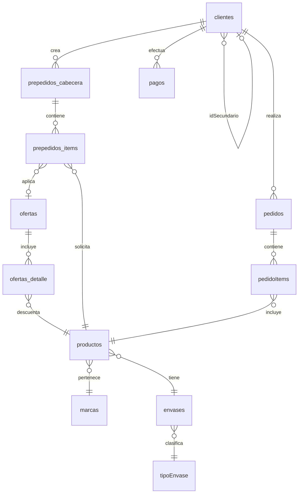
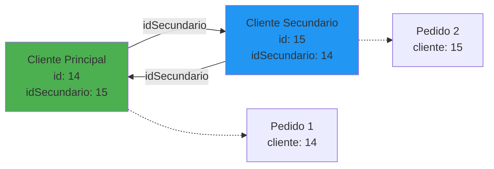

# 🗄️ Esquema de Base de Datos - Sistema Nalub Pedidos

## Información General

**Motor:** MySQL 8.0+ / MariaDB 11.8+  
**Charset:** utf8mb4_unicode_ci  
**Total de Tablas:** 35 tablas activas  
**ORM:** Prisma 5.22.0  

---

## Tablas Principales

### 1. Clientes

**Tabla:** `clientes`  
**Descripción:** Información de clientes del sistema

| Campo | Tipo | Descripción |
|-------|------|-------------|
| `id` | INT PK | ID único del cliente |
| `nombre` | VARCHAR(255) | Nombre completo del cliente |
| `email` | VARCHAR(255) | Email (puede estar vacío) |
| `usuario` | VARCHAR(100) | Usuario para login (típicamente CUIT sin guiones) |
| `password` | VARCHAR(255) | Contraseña hasheada con bcrypt |
| `deuda` | DECIMAL(10,2) | Deuda actual del cliente |
| `fechaUltimoPago` | DATE | Fecha del último pago realizado |
| `cuit` | VARCHAR(20) | CUIT con formato (20-12345678-9) |
| `porcentaje1` | INT | Porcentaje de descuento nivel 1 (0-100) |
| `porcentaje2` | INT | Porcentaje de descuento nivel 2 (0-100) |
| `porcentaje3` | INT | Porcentaje de descuento nivel 3 (0-100) |
| `idSecundario` | INT FK | Referencia a cuenta secundaria (cuenta espejo) |
| `created_at` | TIMESTAMP | Fecha de creación |
| `updated_at` | TIMESTAMP | Fecha de última actualización |

**Relaciones:**
- `idSecundario` → `clientes.id` (autorreferencia para cuentas principales/secundarias)

**Índices:**
- PRIMARY KEY (`id`)
- UNIQUE KEY (`usuario`)
- KEY (`idSecundario`)

---

### 2. Productos

**Tabla:** `productos`  
**Descripción:** Catálogo de productos

| Campo | Tipo | Descripción |
|-------|------|-------------|
| `id` | INT PK | ID único del producto |
| `codigo` | VARCHAR(50) | Código de producto |
| `nombre` | VARCHAR(255) | Nombre del producto |
| `marca` | INT FK | ID de la marca |
| `origen` | VARCHAR(100) | Origen del producto |
| `pack` | INT | Cantidad de unidades por pack |
| `envase` | INT FK | ID del tipo de envase |
| `stockMinimo` | INT | Stock mínimo para alertas |
| `stockActual` | INT | Stock actual disponible |
| `stockReservado` | INT | Stock reservado en prepedidos |
| `precioCompra` | DECIMAL(10,2) | Precio de compra |
| `precioVenta` | DECIMAL(10,2) | Precio de venta base |
| `rentabilidad` | DECIMAL(5,2) | Porcentaje de rentabilidad |
| `foto` | LONGBLOB | Imagen del producto (BLOB) |
| `created_at` | TIMESTAMP | Fecha de creación |
| `updated_at` | TIMESTAMP | Fecha de última actualización |

**Relaciones:**
- `marca` → `marcas.id`
- `envase` → `envases.id`

**Índices:**
- PRIMARY KEY (`id`)
- KEY (`marca`)
- KEY (`envase`)
- KEY (`stockActual`)

---

### 3. Marcas

**Tabla:** `marcas`  
**Descripción:** Marcas de productos

| Campo | Tipo | Descripción |
|-------|------|-------------|
| `id` | INT PK | ID único de la marca |
| `nombre` | VARCHAR(100) | Nombre de la marca |

**Índices:**
- PRIMARY KEY (`id`)

---

### 4. Envases

**Tabla:** `envases`  
**Descripción:** Tipos de envases de productos

| Campo | Tipo | Descripción |
|-------|------|-------------|
| `id` | INT PK | ID único del envase |
| `nombre` | VARCHAR(100) | Nombre del envase (ej: "900ml PET") |
| `litros` | DECIMAL(5,2) | Capacidad en litros |
| `tipoenvaseid` | INT FK | Tipo de envase |

**Relaciones:**
- `tipoenvaseid` → `tipoEnvase.id`

**Índices:**
- PRIMARY KEY (`id`)
- KEY (`tipoenvaseid`)

---

### 5. Tipo de Envase

**Tabla:** `tipoEnvase`  
**Descripción:** Clasificación de envases

| Campo | Tipo | Descripción |
|-------|------|-------------|
| `id` | INT PK | ID único |
| `nombre` | VARCHAR(50) | Tipo (ej: "Botella", "Bidón", "Lata") |

**Índices:**
- PRIMARY KEY (`id`)

---

### 6. Ofertas

**Tabla:** `ofertas`  
**Descripción:** Ofertas promocionales

| Campo | Tipo | Descripción |
|-------|------|-------------|
| `id` | INT PK | ID único de la oferta |
| `titulo` | VARCHAR(255) | Título de la oferta |
| `descripcion` | TEXT | Descripción detallada |
| `fecha_inicio` | DATE | Fecha de inicio de vigencia |
| `fecha_fin` | DATE | Fecha de fin de vigencia |
| `activa` | BOOLEAN | Estado activo/inactivo |
| `created_at` | TIMESTAMP | Fecha de creación |
| `tipo` | VARCHAR(50) | Tipo de oferta (descuento, bundle, etc) |
| `modo_precio` | ENUM | Modo: `precio_unitario`, `precio_pack`, `descuento_pct` |
| `valor_precio` | DECIMAL(10,2) | Valor según modo_precio |
| `min_unidades_total` | INT | Mínimo de unidades para aplicar oferta |
| `unidad_base` | VARCHAR(20) | Unidad (pack, unidad) |

**Modos de Precio:**
- `precio_unitario`: Precio fijo por unidad
- `precio_pack`: Precio fijo por pack
- `descuento_pct`: Porcentaje de descuento

**Índices:**
- PRIMARY KEY (`id`)
- KEY (`activa`)
- KEY (`fecha_inicio`, `fecha_fin`)

---

### 7. Ofertas Detalle

**Tabla:** `ofertas_detalle`  
**Descripción:** Productos incluidos en cada oferta

| Campo | Tipo | Descripción |
|-------|------|-------------|
| `id` | INT PK | ID único del detalle |
| `oferta_id` | INT FK | ID de la oferta |
| `producto_id` | INT FK | ID del producto |
| `unidades_fijas` | INT | Cantidad de unidades en oferta |

**Relaciones:**
- `oferta_id` → `ofertas.id`
- `producto_id` → `productos.id`

**Índices:**
- PRIMARY KEY (`id`)
- KEY (`oferta_id`)
- KEY (`producto_id`)
- UNIQUE KEY (`oferta_id`, `producto_id`)

---

### 8. Prepedidos Cabecera

**Tabla:** `prepedidos_cabecera`  
**Descripción:** Encabezado de prepedidos

| Campo | Tipo | Descripción |
|-------|------|-------------|
| `id` | INT PK | ID único del prepedido |
| `cliente_id` | INT | ID del cliente (sin FK en BD) |
| `estado` | ENUM | Estado: `borrador`, `enviado`, `procesado` |
| `fecha_creacion` | TIMESTAMP | Fecha de creación |
| `fecha_modificacion` | TIMESTAMP | Fecha de última modificación |
| `observaciones` | TEXT | Observaciones del prepedido |

**Estados:**
- `borrador`: Prepedido en edición
- `enviado`: Enviado para procesamiento
- `procesado`: Convertido a pedido

**Índices:**
- PRIMARY KEY (`id`)
- KEY (`cliente_id`)
- KEY (`estado`)

---

### 9. Prepedidos Items

**Tabla:** `prepedidos_items`  
**Descripción:** Items de cada prepedido

| Campo | Tipo | Descripción |
|-------|------|-------------|
| `id` | INT PK | ID único del item |
| `prepedido_id` | INT FK | ID del prepedido |
| `producto_id` | INT | ID del producto (sin FK en BD) |
| `cantidad` | INT | Cantidad solicitada |
| `precio_estimado` | DECIMAL(10,2) | Precio estimado al momento |
| `oferta_id` | INT NULL | ID de oferta aplicada (puede ser NULL) |

**Relaciones:**
- `prepedido_id` → `prepedidos_cabecera.id` (FK con CASCADE DELETE)

**Índices:**
- PRIMARY KEY (`id`)
- KEY (`prepedido_id`)
- KEY (`producto_id`)
- KEY (`oferta_id`)

---

### 10. Pedidos

**Tabla:** `pedidos`  
**Descripción:** Pedidos confirmados

| Campo | Tipo | Descripción |
|-------|------|-------------|
| `id` | INT PK | ID único del pedido |
| `cliente` | INT | ID del cliente (puede ser principal o secundario) |
| `fechaEntrega` | DATE | Fecha estimada de entrega |
| `estado` | VARCHAR(50) | Estado del pedido |
| `importeTotal` | DECIMAL(10,2) | Importe total del pedido |
| `observaciones` | TEXT | Observaciones |
| `created_at` | TIMESTAMP | Fecha de creación |

**Estados comunes:**
- `Pendiente`, `En Proceso`, `Entregado`, `Cancelado`

**Índices:**
- PRIMARY KEY (`id`)
- KEY (`cliente`)
- KEY (`fechaEntrega`)
- KEY (`estado`)

---

### 11. Pedido Items

**Tabla:** `pedidoItems`  
**Descripción:** Items de cada pedido

| Campo | Tipo | Descripción |
|-------|------|-------------|
| `id` | INT PK | ID único del item |
| `pedidoId` | INT FK | ID del pedido |
| `productoId` | INT | ID del producto |
| `cantidad` | INT | Cantidad |
| `precio_unitario` | DECIMAL(10,2) | Precio unitario al momento |

**Relaciones:**
- `pedidoId` → `pedidos.id`

**Índices:**
- PRIMARY KEY (`id`)
- KEY (`pedidoId`)
- KEY (`productoId`)

---

### 12. Pagos

**Tabla:** `pagos`  
**Descripción:** Historial de pagos

| Campo | Tipo | Descripción |
|-------|------|-------------|
| `id` | INT PK | ID único del pago |
| `clienteId` | INT | ID del cliente |
| `fechaRecep` | DATE | Fecha de recepción del pago |
| `tipoMedioPagoId` | INT | Tipo de medio de pago |
| `importe` | DECIMAL(10,2) | Importe del pago |
| `receptor` | VARCHAR(255) | Persona que recibió el pago |

**Tipos de Medio de Pago:**
- `1` = Efectivo
- `2` = Transferencia
- `3` = Cheque
- `4` = Tarjeta

**Índices:**
- PRIMARY KEY (`id`)
- KEY (`clienteId`)
- KEY (`fechaRecep`)

---

## Diagramas de Relaciones

### Diagrama ER Principal



### Diagrama de Cuentas Principales/Secundarias



---

## Tabla de Migraciones

### Esquema Actual vs Original

| Operación | Fecha | Descripción |
|-----------|-------|-------------|
| Creación inicial | 2024-2025 | Esquema base con 30 tablas |
| Migración ofertas | Ene 2025 | Agregar campos `modo_precio`, `valor_precio`, `min_unidades_total` |
| Fix ofertas data | Ene 2025 | Actualizar datos de ofertas existentes |
| Fase 2 Backend | Feb 2026 | Migración a Prisma ORM, sin cambios de esquema |

---

## Notas de Diseño

### 1. Foreign Keys

⚠️ **IMPORTANTE:** Algunas tablas NO tienen foreign keys en la base de datos física, pero se manejan con validación en la aplicación:

**Sin FK en BD:**
- `prepedidos_cabecera.cliente_id` → `clientes.id` (validado en app)
- `prepedidos_items.producto_id` → `productos.id` (validado en app)
- `prepedidos_items.oferta_id` → `ofertas.id` (validado en app, puede ser NULL)

**Con FK en BD:**
- `prepedidos_items.prepedido_id` → `prepedidos_cabecera.id` (ON DELETE CASCADE)

**Razón:** Decisión de diseño original para facilitar la gestión de datos sin trabas de integridad referencial estricta.

### 2. Cuentas Principales y Secundarias

Los clientes tienen una estructura de cuentas duales:
- Campo `idSecundario` crea una relación bidireccional
- Ambas cuentas pueden tener pedidos y deuda independientes
- Los consulores deben verificar AMBAS cuentas al mostrar historial

**Queries correctas:**
```sql
-- Pedidos de cliente (incluye principal y secundario)
SELECT * FROM pedidos p
JOIN clientes c ON (p.cliente = c.id OR p.cliente = c.idSecundario)
WHERE c.id = ?
```

### 3. Tipos DECIMAL

**Campos monetarios:**
- Usar DECIMAL(10,2) para evitar errores de redondeo
- Prisma los mapea a JavaScript como `Prisma.Decimal`
- Convertir a float/number para JSON: `parseFloat(valor.toString())`

### 4. Imágenes BLOB

Las imágenes se almacenan como LONGBLOB:
- Conversión a base64 en backend
- Formato: `data:image/jpeg;base64,<base64_string>`
- Mostrar directamente en tag `` del frontend

---

## Consultas Optimizadas

### 1. Productos con Stock

```sql
SELECT * FROM productos
WHERE stockActual > 0 AND precioVenta > 0
ORDER BY nombre ASC
```

### 2. Ofertas Vigentes

```sql
SELECT * FROM ofertas
WHERE activa = 1
  AND fecha_inicio <= CURDATE()
  AND fecha_fin >= CURDATE()
ORDER BY created_at DESC
```

### 3. Prepedidos del Cliente

```sql
SELECT pc.*, COUNT(pi.id) as items_count
FROM prepedidos_cabecera pc
LEFT JOIN prepedidos_items pi ON pc.id = pi.prepedido_id
WHERE pc.cliente_id = ?
GROUP BY pc.id
ORDER BY pc.fecha_creacion DESC
```

### 4. Pedidos del Año Actual (Principal + Secundario)

```sql
SELECT p.* FROM pedidos p
WHERE (p.cliente = ? OR p.cliente = ?)
  AND YEAR(p.fechaEntrega) = YEAR(CURDATE())
ORDER BY p.fechaEntrega DESC
```

---

## Índices y Performance

### Índices Recomendados

**Ya implementados:**
- ✅ PRIMARY KEYS en todas las tablas
- ✅ FOREIGN KEYS donde corresponde
- ✅ Índices en campos de búsqueda frecuente

**Sugerencias adicionales:**
- [ ] Índice compuesto en `ofertas (activa, fecha_inicio, fecha_fin)`
- [ ] Índice en `productos.nombre` para búsquedas de texto
- [ ] Índice en `pedidos (cliente, fechaEntrega)` compuesto

### Query Performance

**Métricas actuales:**
- Query simple de productos: < 50ms
- Query con joins (ofertas + detalles): 100-200ms
- Dashboard completo: 200-300ms

---

## Backup y Restore

### Exportar Base de Datos

```bash
# Exportar todas las tablas
mysqldump -u root -p u136155607_nalubnew > backup_$(date +%Y%m%d).sql

# Exportar solo estructura
mysqldump -u root -p --no-data u136155607_nalubnew > estructura.sql
```

### Importar Base de Datos

```bash
mysql -u root -p u136155607_nalubnew < backup_20260206.sql
```

---

## Usuarios y Permisos

### Usuario de Aplicación

```sql
CREATE USER 'nalub_app'@'localhost' IDENTIFIED BY 'secure_password';
GRANT SELECT, INSERT, UPDATE, DELETE ON u136155607_nalubnew.* TO 'nalub_app'@'localhost';
FLUSH PRIVILEGES;
```

**Nota:** NO dar permisos de DROP o ALTER a la aplicación.

---

## Tablas Adicionales

El sistema tiene 35 tablas en total. Las 12 documentadas arriba son las principales. Otras tablas incluyen:

- `deuda`, `deuda2` - Tablas de deuda (sin PK, ignoradas por Prisma)
- `maeclientes` - Maestro de clientes (sin PK, ignorada)
- `ofertas_backup` - Backup de ofertas (sin PK, ignorada)
- `prodv2` - Versión alternativa de productos (sin PK, ignorada)
- Y más tablas auxiliares...

---

**Última actualización:** Febrero 2026  
**Versión del esquema:** 1.0
